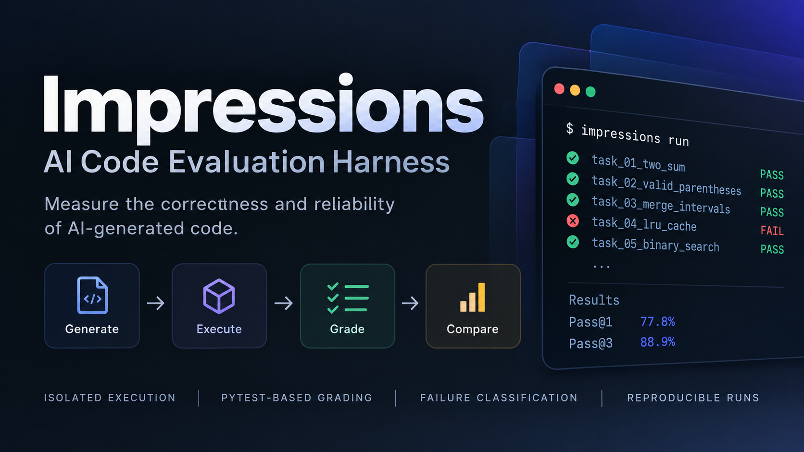

<p align="center">
  
</p>

<p align="center">
  Deterministic, reproducible evaluation of AI-generated code.
</p>

# Impressions: AI Code Evaluation Harness

Impressions measures the correctness and reliability of AI-generated code with deterministic, reproducible signals: structured coding tasks, model-generated solutions, isolated Docker execution, pytest-based grading, failure classification, pass@k reliability metrics, and versioned run outputs.

## Quick start

```bash
git clone https://github.com/josephrolabs/impressions.git
cd impressions
python -m venv .venv && source .venv/bin/activate
pip install -e . --group dev
pytest
```

Scaffold a project, point it at the benchmark, and run it:

```bash
impressions init my-eval && cd my-eval
# set paths.tasks to /path/to/impressions/benchmarks/mvp/tasks in impressions.toml
export OPENAI_API_KEY=...   # or ANTHROPIC_API_KEY, GEMINI_API_KEY, META_API_KEY
docker build -t impressions-python-pytest:3.12 /path/to/impressions/docker/pytest
impressions run --k 3
impressions report reports/<run-id>
```

No API key? `impressions run` falls back to a deterministic echo client so you can verify the whole pipeline without spending anything.

## Model providers

| Provider | Config value | Key env var | Example model |
|---|---|---|---|
| OpenAI | `openai` | `OPENAI_API_KEY` | `gpt-5` |
| Anthropic Claude | `anthropic` | `ANTHROPIC_API_KEY` | `claude-opus-4-6` |
| Google Gemini | `gemini` | `GEMINI_API_KEY` | `gemini-2.5-pro` |
| Meta Muse Spark | `meta` | `META_API_KEY` | `muse-spark-1.1` |

```toml
[model]
provider = "anthropic"
model = "claude-opus-4-6"
timeout = 60

[credentials]
api_key_env = "ANTHROPIC_API_KEY"
```

Keys are read from the environment named by `api_key_env` — never from config files. When the key is unset, the run uses the deterministic echo fallback and says so. Each provider client captures token usage and provider metadata (response IDs, stop/finish reasons) into the run artifacts.

## The MVP benchmark

`benchmarks/mvp/tasks` holds 10 deterministic Python tasks (3 easy, 4 medium, 3 hard), each with a task-local pytest suite and a canonical reference solution used by the repo's integrity tests (never shown to the model).

| Task | Difficulty | Category | What it tests |
|---|---|---|---|
| reverse-words | easy | function_generation | string manipulation |
| slugify-title | easy | function_generation | string normalization |
| clamp-value | easy | error_handling | bounds + input validation |
| parse-records | medium | error_handling | parsing with malformed input |
| merge-intervals | medium | function_generation | classic algorithm |
| inventory-repair | medium | multi_file_repair | reuse a fixture module correctly |
| validate-password | medium | test_writing | write tests for a supplied implementation |
| lru-cache | hard | refactor | reimplement on a legacy fixture base class |
| topological-sort | hard | function_generation | graph algorithm + cycle detection |
| repair-checkout | hard | debugging | explore a 3-file package, diagnose 2 bugs, compose a correct fix |

The suite is a compact, reproducible smoke/regression benchmark — not a public leaderboard.

## Benchmark results

Model comparison runs go here. Each cell is observed pass@k; run IDs link the numbers to their persisted artifacts.

| Model | pass@1 | pass@3 | Run ID |
|---|---|---|---|
| _pending_ | – | – | – |

Results are produced by `impressions run --k 3` against the MVP benchmark and rendered with `impressions report` / `impressions compare`. No fabricated numbers: every figure must trace to a run directory under `reports/`.

## How it works

```text
Task YAML → Prompt Builder → Model Client → Docker Sandbox → pytest → Failure Classification → Scoring → Run Registry
```

1. **Prompt Builder** renders versioned prompts (`baseline` / `engineered` variants) and records the exact text per attempt.
2. **Model Client** calls the configured provider and captures text, token usage, and metadata.
3. **Docker Sandbox** executes the generated entrypoint with no network, a read-only root filesystem, dropped capabilities, memory/PID limits, and an unprivileged user. The base image is pinned by digest and pytest is pinned to 8.4.0 for reproducibility.
4. **Pytest grading** runs the task's own test suite against the generated code inside the sandbox.
5. **Failure classification** assigns each failure a deterministic category: `syntax_error`, `runtime_error`, `test_failure`, `timeout`, `format_error`, or `other`.
6. **Scoring** computes first-attempt success rate, observed pass@k, and mean attempts to success.
7. **Run registry** persists `run.json`, `config.json`, and `summary.json` under a timestamped run directory, recording the prompt variant/version, model configuration, per-attempt outputs, and aggregate metrics.

## CLI reference

```bash
impressions init [path]          # scaffold a project
impressions config show           # inspect loaded configuration
impressions tasks list            # list discovered tasks
impressions tasks validate        # validate task files
impressions evaluate              # deterministic echo evaluation (no model calls)
impressions run --k 3             # full model → sandbox → pytest workflow
impressions report <run-dir>      # render a saved run
impressions compare <run-a> <run-b>  # candidate-minus-baseline deltas
```

`run` checks for the `impressions-python-pytest:3.12` image first and prints the exact `docker build` command when it is missing.

## Task format

Tasks are versioned YAML files:

```yaml
version: 1
name: merge-intervals
description: Merge overlapping intervals.
input:
  prompt: |
    Write a function merge(intervals) ...
expected:
  type: code
execution:
  entrypoint: solution.py
  tests: tests/test_merge_intervals.py
  files:
    - fixtures/helpers.py     # optional, mounted alongside the entrypoint
  timeout_seconds: 30
metadata:
  difficulty: medium
  category: function_generation
```

The generated code is written to `entrypoint`; `tests` and `files` are mounted read-only in the sandbox. Test paths must stay inside the task directory.

## Configuration

```toml
version = 1

[paths]
tasks = "tasks"
reports = "reports"

[model]
provider = "openai"
model = "gpt-5"
timeout = 30

[credentials]
api_key_env = "OPENAI_API_KEY"

[evaluation]
attempts = 3
pass_at_k = 3

[prompt]
variant = "engineered"
```

## Design principles

- **Deterministic-first:** objective, reproducible checks are the foundation; subjective scoring comes later.
- **Correctness first, nuance later:** if a signal can't be measured deterministically, it waits.
- **Composable:** config, task loading, prompting, model clients, execution, grading, scoring, and reporting are separate concerns behind stable interfaces.
- **Reproducible:** pinned images, pinned dependencies, versioned prompts, and persisted run artifacts.
- **Test-first:** new behavior ships with focused tests (193 and counting).

## Repository structure

```text
.
├── impressions/
│   ├── cli.py
│   └── core/
│       ├── config.py            # impressions.toml loading and validation
│       ├── tasks.py             # YAML task discovery, parsing, validation
│       ├── prompt_builder.py    # versioned prompt rendering
│       ├── model_client.py      # ModelClient protocol, echo fallback
│       ├── model_factory.py     # provider dispatch
│       ├── openai_client.py     # OpenAI Responses API
│       ├── anthropic_client.py  # Anthropic Messages API
│       ├── gemini_client.py     # Gemini Developer API
│       ├── meta_client.py       # Meta Model API (OpenAI-compatible)
│       ├── docker_executor.py   # sandboxed execution via Docker CLI
│       ├── pytest_grader.py     # pytest grading + output parsing
│       ├── failure_classification.py
│       ├── scoring.py           # pass@k, first-attempt, attempts-to-success
│       ├── evaluation.py        # evaluator protocol, engine, echo evaluator
│       ├── llm_evaluator.py     # model → grade pipeline
│       ├── code_evaluator.py
│       └── reporting.py         # run registry, report, compare
├── benchmarks/mvp/
│   ├── tasks/                   # 10 task YAMLs + tests + fixtures
│   └── reference_solutions/     # canonical solutions (integrity tests only)
├── docker/pytest/               # digest-pinned pytest execution image
└── tests/
```

## Long-term direction

The implemented pipeline above is the working core. Longer-term directions being considered:

```text
Problem Dataset → Prompt Builder → Model Layer → Execution Sandbox → Test Runner → Scoring Engine → Results Store → Analysis and Reporting
```

- Multi-model comparison runs and leaderboards over larger task suites.
- LLM-as-judge scoring for readability and explanation quality (after deterministic signals).
- Static analysis (Ruff, Bandit, Semgrep) as additional deterministic graders.
- Cost and latency dashboards per model/task.
- CI integration for scheduled eval runs and regression tracking.
- Web dashboard and failure clustering.

## Scoring philosophy

**Tier 1 — Functional correctness:** does the code do what it should? Binary pytest outcomes are the primary ground truth.

**Tier 2 — Failure mode classification:** when code fails, why? Parser errors, exit codes, pytest output, and timeouts map to the six failure categories.

**Tier 3 — Behavioral reliability:** first-attempt success, attempts to success, observed pass@k, plus token usage and latency where providers report them.

## Background: why "Impressions"?

AI systems are non-deterministic: like a jazz performance, a model explores a unique melody every invocation. This project is named for the John Coltrane standard — just as a jazz composition gives structure to improvisation, this harness gives structure to evaluation. Each run gathers a collection of *impressions* of a model's capabilities: deterministic checks first, qualitative judgment later.
